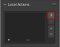
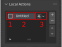
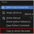
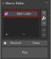

# First Action
## Adding Actions
:::{figure-md}

To add an Action press the `+`-Button.
:::

:::{figure-md}

 A new Action appears in the list. Which consist of 3 Parts.
:::

**1. Icon**
: By clicking on the Icon it can be changed to customize the look of the action.

**2. Label**
: By double-click on the Label it can be changed and by default it will be `Untitled`.

**3. Execution Mode**
: This can be changed to execute between `Group`-Execution and `Individual`-Execution.
    - **Group**: Performs the current action on all selected objects without separating them (Default Behavior)
    - **Individual**: Performs the current action on all selected objects individually. Therefore, the action is executed as many times as there are selected objects.

## Adding Macros
:::{figure-md}

To add a Macro 4 Options are available.
:::

**➕ Add**
: This will add the latest used command as a Macro.
If the setting `Create Empty on Error` is checked it will create an empty Macro if no command is available. (Shortcut: `alt + ,`)

**🔧 Event**
: This will show a list of possible events. E.g. with the `Clipboard`-Event the content of the Clipboard is imported as a Macro. Also see [Event List](../panels/macro.md#event-list)

**🔴 Record**
: This will record all commands that you execute until the `Stop`-Button is pressed, which appears after record is pressed.

**Context Menu**
: {align=right} By right-click on a property or button the context menu appears with a new option: `Copy To Action Recorder`. This will add the right-clicked property/button as a Macro.

\
We now have a Macro. This can be `activated` and `deactivated` through the check-box. By double-click on the label the Macro can be edited through a dialog.