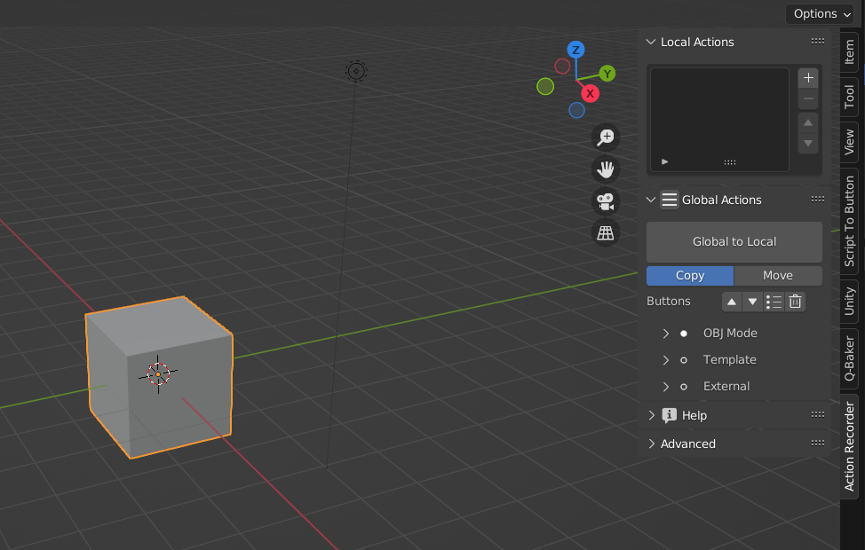

# Installation

 
On the right side of this page, there is a "Release" section 
Click on the text "Action Recorder X.X.X" in the "Release" section  
Download the Zip file from this button which is located on the bottom under "Assets" 
The next step is the same as the normal add-on installation 

Header Menu > Edit > Preferences > Add-ons > Install 
  

Select the Zip file you downloaded 
  
Click the "Install Add-on" button 

Finished! Now you can see a Tab "Action Recorder" in the UI (by pressing `N`)