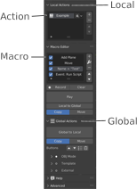

# Terms & Definition

## Action
Consist of multiple Macros.

## Macro
Stores the commands to be executed.
Mostly they store Blender Operations such as Operator (bpy.ops.xx.xx) or Context changes (bpy.context.xx.xx = xx).
But they can also contain regular python code.

## Local
Available only in the project file.
The selected action can be executed with the `Play`-Button (Shortcut: `alt + .`)
Direct editing of macros is possible.
If you want to edit the Global macro, move it to Local and then edit it.

## Global
It can be shared and used with other project files as well.
By default it is saved in the `Storage.json` file which is located inside the install directory of the Add-on.

:::{hint}
By default this would be\
`
C:\Users\<USER>\AppData\Roaming\Blender Foundation\Blender\3.3\scripts\addons\ActRec\Storage.json
`
:::