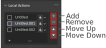

# Local Action

## Action
:::{figure-md}

 A local Action consist of 3 Parts.
:::

**1. Icon**
: By clicking on the Icon it can be changed to customize the look of the Action.

**2. Label**
: By double-click on the Label it can be changed and by default it will be `Untitled`.

**3. Execution Mode**
: This can be changed to execute between `Group`-Execution and `Individual`-Execution.
    - **Group**: Performs the current action on all selected objects without separating them (Default Behavior)
    - **Individual**: Performs the current action on all selected objects individually. Therefore, the action is executed as many times as there are selected objects.

## Operations

### Add
Adds a new Local Action to the project and select it.

### Remove
Remove to selected Local Action.

### Move Up
Move to selected Local Action one position up in the list and swap it with the next upper Action.

### Move Down
Move to selected Local Action one position down in the list and swap it with the next lower Action.

### Selection Up
Sets the selection to the next upper Action.
:::{attention}
Only available through shortcut. Default is `Shift + Alt + Wheel Up`
:::

### Selection Down
Sets the selection to the next lower Action.
:::{attention}
Only available through shortcut. Default is `Shift + Alt + Wheel Down`
:::
